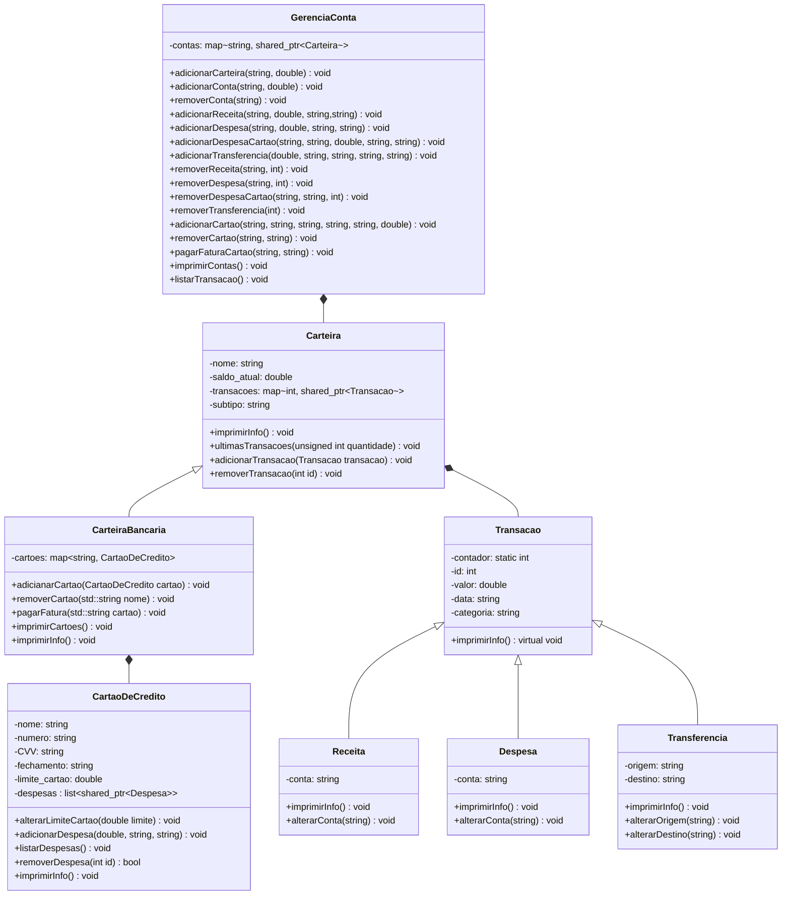

```mermaid
classDiagram

class GerenciaConta {
    -contas: map~string, shared_ptr~Carteira~~

    +adicionarCarteira(string, double) void
    +adicionarConta(string, double) void

    +removerConta(string) void

    +adicionarReceita(string, double, string,string) void
    +adicionarDespesa(string, double, string, string) void
    +adicionarDespesaCartao(string, string, double, string, string) void
    +adicionarTransferencia(double, string, string, string, string) void

    +removerReceita(string, int) void
    +removerDespesa(string, int) void
    +removerDespesaCartao(string, string, int) void
    +removerTransferencia(int) void

    +adicionarCartao(string, string, string, string, string, double) void
    +removerCartao(string, string) void
    +pagarFaturaCartao(string, string) void
    +imprimirContas() void
    +listarTransacao() void
}

GerenciaConta *-- Carteira

class Carteira {
    -nome: string
    -saldo_atual: double
    -transacoes: map~int, shared_ptr~Transacao~~
    -subtipo: string

    +imprimirInfo() void
    +ultimasTransacoes(unsigned int quantidade) void
    +adicionarTransacao(Transacao transacao) void
    +removerTransacao(int id) void
}

Carteira <|-- CarteiraBancaria
Carteira *-- Transacao

class CarteiraBancaria {
    -cartoes: map~string, CartaoDeCredito~

    +adicianarCartao(CartaoDeCredito cartao) void
    +removerCartao(std::string nome) void 
    +pagarFatura(std::string cartao) void
    +imprimirCartoes() void
    +imprimirInfo() void
}

CarteiraBancaria *-- CartaoDeCredito

class CartaoDeCredito {
    -nome: string
    -numero: string
    -CVV: string
    -fechamento: string
    -limite_cartao: double
    -despesas : list~shared_ptr~Despesa~~

    +alterarLimiteCartao(double limite) void
    +adicionarDespesa(double, string, string) void
    +listarDespesas() void
    +removerDespesa(int id) bool
    +imprimirInfo() void
}

class Transacao {
    -contador: static int
    -id: int
    -valor: double
    -data: string
    -categoria: string

    +imprimirInfo() virtual void
}

Transacao <|-- Receita
Transacao <|-- Despesa
Transacao <|-- Transferencia

class Receita {
    -conta: string 

    +imprimirInfo() void
    +alterarConta(string) void
}

class Despesa {
    -conta: string

    +imprimirInfo() void
    +alterarConta(string) void
}

class Transferencia {
    -origem: string
    -destino: string

    +imprimirInfo() void
    +alterarOrigem(string) void
    +alterarDestino(string) void
}

```