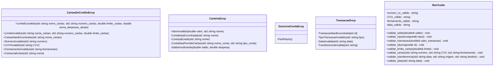

```mermaid
classDiagram

class CartaoDeCreditoExcp {
    +LimiteExcedido(std::string nome_cartao, std::string numero_cartao, double limite_cartao, double soma_despesas_atuais)
    +LimiteInvalido(std::string nome_cartao, std::string numero_cartao, double limite_cartao)
    +CartaoNaoEncontrado(std::string nome_cartao)
    +NumeroInvalido(std::string numero)
    +CVVInvalido(std::string CVV) 
    +FechamentoInvalido(std::string fechamento)
    +CartaoJaExiste(std::string nome)
}

class CarteiraExcp {
    -ValorInvalido(double valor, std::string nome)
    -ContaNaoEncontrada(std::string nome)
    -ContaJaExiste(std::string nome)
    -ContaNaoPermiteCartao(std::string nome_conta, std::string tipo_conta)
    -SaldoInsuficiente(double saldo, double despesa)
}

class GerenciaContaExcp {
    -PerfilVazio()
}

class TransacaoExcp {
    -TransacaoNaoEncontrada(int id)
    -TipoTransacaoInvalido(std::string tipo)
    -DataInvalida(std::string data)
    -TransferenciaInvalida(std::string)
}

class Barricada {
    -numero_cc_valido : string
    -CVV_valido : string
    -fechamento_valido : string
    -data_valida : string

    +validar_saldo(double& saldo) void
    +validar_input(unsigned& input) void
    +validar_transacao(double& valor_transacao) void
    +validar_id(unsigned& id) void
    +validar_limite_cartao(double& limite) void
    +validar_cartao(std::string numero, std::string CVV, std::string fechamento) void
    +validar_transferencia(std::string data, std::string origem, std::string destino) void
    +validar_data(std::string data) void
}

```